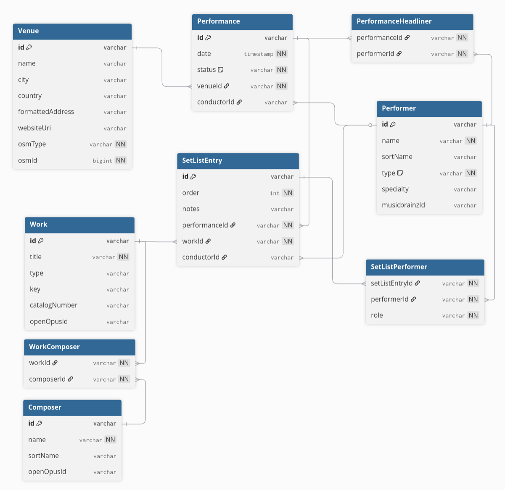

# Overview
This is a REST API for logging classical music concert attendance. 
Designed to capture the full complexity of classical music concerts, from core details like venue, orchestra, and conductor, to nuances like guest conductors and featured soloists.

It is intended to serve as a backend for future web and mobile clients.

# Features

## Classical Music Modeling
Concerts are structured as Performances containing an ordered set list of Works.

Each set list entry supports its own conductor and featured performers, separate from the top-level performance, letting you track a guest conductor who leads only specific pieces or a soloist who only plays one piece.

Performers are categorized by type (Orchestra, Ensemble, Conductor, Solo, Chorus).

Venues store a formatted address and website, and link to an [OpenStreetMap](https://www.openstreetmap.org/) entity.

# Technical Details
This API was built with [TypeScript](https://www.typescriptlang.org/) and [Hono](https://hono.dev/) running on [Node.js](https://nodejs.org/en).

## Libraries
[PostgreSQL](https://www.postgresql.org/) for the database.
 
[Prisma ORM](https://www.prisma.io/) for database access and migrations.
 
[`@prisma/adapter-pg`](https://www.npmjs.com/package/@prisma/adapter-pg) to connect Prisma to PostgreSQL.
 
[Zod](https://zod.dev/) with `@hono/zod-validator` for validating requests sent to the API.
 
[Vitest](https://vitest.dev/) for automated testing.
 
[Testcontainers](https://testcontainers.com/) for running a test PostgreSQL database.
 
[Docker](https://www.docker.com/) with compose for self-hosting.

## External APIs
[MusicBrainz](https://musicbrainz.org/) for metadata enrichment for performers and conductors.
 
[OpenOpus](https://openopus.org/) for metadata enrichment for composers and works.
 
[OpenStreetMap](https://www.openstreetmap.org/) for choosing and linking to venues.
